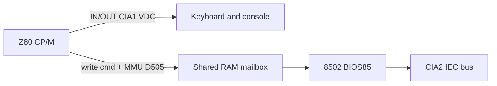

# Z80 / CP/M Diagnostic Test Environment

> Copied into the repo for machine handoff. Original Cursor plan:
> `z80_cp_m_test_env_3dbc249f`. See also [`../HANDOVER-z80-cpm.md`](../HANDOVER-z80-cpm.md).

## Status

| Item | Status |
|------|--------|
| Hypothesis doc (`doc/z80-cpm-debug.md`) | Done |
| Patch audit (`doc/c128-mister-patch-audit.md`) | Done |
| Z80 diag + VICE smoke (`CORE/diag/z80`) | Done (VICE register snapshot) |
| ILA bundle from `main.vhd` | Pending (needs Vivado) |
| Sim benches `tb_z80_cia_iorq` / `tb_z80_mailbox` | Pending (needs Vivado) |
| Virtual IEC (`C_VDNUM`, mount menu, D71) | Pending |

## Overview

Build a layered Z80/CP/M debug environment that isolates MEGA65 integration bugs (memory, keyboard bridge, mailbox timing) without modifying the stable C128_MiSTer core, then add virtual IEC mounts so CP/M boot no longer depends on physical disks.

## Hard constraint: C128_MiSTer is stable

Treat [`CORE/C128_MiSTer`](../../CORE/C128_MiSTer) as a **known-good upstream core** (MiSTer hardware works). Do **not** chase CP/M keyboard symptoms by patching CIA/`WAIT_n`/`alt_crsr`/`k_reg` inside the submodule.

**Ignore** historical keyboard “Fix 1–5” notes formerly in `KNOWN_BUGS.md`. They point at the wrong layer. Suspect the MEGA65 integration instead:

- [`CORE/vhdl/main.vhd`](../../CORE/vhdl/main.vhd) — BRAM/ROM memory path, keyboard→`ps2_key` bridge, IEC pin wiring, reset/CSR
- Clock / enable / bus timing differences vs MiSTer SDRAM
- Existing **local** submodule edits already made for MEGA65 (first-fetch prime, `reset_t80`, VIC `vicRamDin`, etc.) — audit whether those are integration necessities or accidental root causes

Any future RTL fix should land in MEGA65 glue first. Submodule changes only if a true upstream bug is proven against stock MiSTer behavior.

## Problem framing

Two observed CP/M symptoms are **not necessarily the same bug**. Both disk images boot cleanly in VICE (including the one that shows Disk L on MEGA65 — **VICE does not require inserting any second disk** for that image). So Disk L on hardware is a **spurious MEGA65 failure**, not a normal multi-volume layout difference.

| Symptom on MEGA65 | Likely path | VICE / image note |
|---|---|---|
| Reaches `A>` but keys wrong/dead | Z80 IORQ path stressed; MEGA65 keyboard bridge or memory/bus timing around Z80 cycles | Same image interactive in VICE |
| Stops at `Insert Disk L in Drive A` (Enter useless) | Bogus BIOS/drive/mailbox state: thinks volume L is missing or waits for a key/disk event that never completes correctly | **Same image does not ask for Disk L in VICE** — treat as integration bug |

Architecture (software mailbox, not an RTL block):

C128 mode working proves MEGA65 matrix + 8502 paths under normal C128 timing. CP/M additionally stresses **Z80-active** cycles and **MMU/BUSRQ handoff** — both sensitive to how MEGA65 wraps the core.

Current gaps:

- Boot sim ([`CORE/sim/tb_c128_boot.vhd`](../../CORE/sim/tb_c128_boot.vhd)) only gates Z80→8502 handoff, not IORQ/CIA/mailbox under the BRAM model.
- Virtual IEC disabled (`C_VDNUM = 0` in [`CORE/vhdl/globals.vhd`](../../CORE/vhdl/globals.vhd)); only real IEC is wired.
- Z80 offline diag exists (`CORE/diag/z80`); MEGA65 load path for that binary is still TBD.

## Strategy (committed): phased both

**Phase A first** (fast feedback, no disk dependency): Z80 self-test + sim/ILA aimed at MEGA65 glue.  
**Phase B next**: virtual IEC mounts so full CP/M boot is scriptable.  
Do **not** start by editing C128_MiSTer keyboard/CIA RTL based on boot-disk runs.

---

## Phase A1 — Hypothesis catalog and probe plan

See [`doc/z80-cpm-debug.md`](../z80-cpm-debug.md) (done). Focus on integration:

1. **MEGA65 keyboard→`ps2_key` bridge** wrong/noisy only when Z80 owns the bus
2. **BRAM/ROM 1-cycle latency / memory mux** corrupts Z80 IORQ or code stream
3. **Mailbox switch broken/partial** under MEGA65 reset/enable wrapping
4. **IEC/mailbox returns wrong disk data or status** → spurious Disk L
5. **Existing MEGA65 submodule diffs** change Z80-era behaviour vs stock MiSTer

Wire a debug bundle from [`main.vhd`](../../CORE/vhdl/main.vhd) for ILA, preferring **already-exported** core ports (`boot_z80_n_o`, existing `dbg_*` currently tied to `open`, IEC lines, keyboard bridge signals). Avoid new C128_MiSTer keyboard patches.

---

## Phase A2 — Z80 hardware self-test

Done offline: [`CORE/diag/z80`](../../CORE/diag/z80). VICE smoke checks register snapshot at `halt_loop`. Still need a MEGA65 delivery path (Function ROM / ROM load / mount).

| Test | What it proves |
|---|---|
| T1 | Z80 ran / magic published |
| T2 | Idle CIA1 matrix via Z80 IORQ |
| T3 | Keys `1`, `Z`, Return bitmaps |
| T4 | Mailbox ping-pong (`$D505` + shared RAM) |
| T5 | Optional IEC via mailbox (HW later) |

---

## Phase A3 — Extend simulation beyond boot handoff

Keep [`run_boot_sim.sh`](../../CORE/scripts/run_boot_sim.sh) as gate 0. Add benches that exercise the **MEGA65 BRAM-wrapped** `main` path:

| Bench | Stimulus | Pass criteria |
|---|---|---|
| `tb_z80_cia_iorq` | Inject matrix / `ps2_key`-equivalent; Z80 reads CIA | Stable expected `$DC01` values across VIC phases |
| `tb_z80_mailbox` | Tiny Z80+8502 co-program | N successful handoffs; shared RAM magic |

---

## Phase A4 — Patch audit

Done: [`doc/c128-mister-patch-audit.md`](../c128-mister-patch-audit.md). Do **not** add WAIT_n / alt_crsr / k_reg experiments from old KNOWN_BUGS notes.

Notable open item from audit: `vicRamDin => ram_data` is still TEMP in `main.vhd` (snow-fix port not actually delayed).

---

## Phase B — Virtual IEC

After mailbox/keyboard paths are classified via diag:

1. Enable M2M virtual drives + MiSTer `iec_drive` in MEGA65 glue (`C_VDNUM`, buffers, mount menu; prefer D71)
2. Golden workflow: same image on MiSTer and MEGA65
3. Keep real IEC as a second lane

---

## Why the two disks behave differently (working theory)

- Different CP/M disk versions exercise different BIOS/drive code paths; both are valid (VICE OK).
- Disk A reaches `A>` → enough of that image’s boot/mailbox path works; remaining failure is Z80-visible input under MEGA65 wrapping.
- Disk B’s `Insert Disk L` is **not** a real second-disk requirement (VICE continues without it). On MEGA65 it means wrong drive/mailbox state and/or stuck key wait.
- Diag T3 vs T4 vs T5 separates those cases.

## Success criteria

- Z80 diag T2/T3/T4 give clear pass/fail on MEGA65 without CP/M disks.
- Sim benches cover IORQ + mailbox on the BRAM-wrapped path beside boot handoff.
- Written audit of local `C128_MiSTer` diffs; no new keyboard hacks in the submodule.
- At least one CP/M image boots to interactive `A>` with working input (virtual or real IEC).

## Out of scope

- Patching C128_MiSTer keyboard/CIA/Z80 WAIT logic based on old KNOWN_BUGS notes.
- Fixing every CP/M application.
- Full VDC/80-col focus before VIC/40-col diag is clear.
