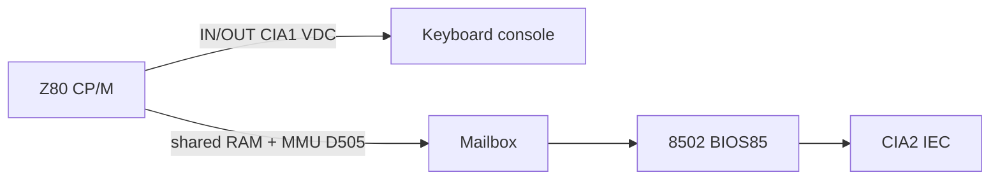

# Z80 / CP/M debug plan (MEGA65 integration)

Working notes for CP/M boot issues on the MEGA65 port. Companion docs:

- **Handover (start here on a new machine):** [`HANDOVER-z80-cpm.md`](HANDOVER-z80-cpm.md)
- Full plan: [`plans/z80-cpm-test-env.md`](plans/z80-cpm-test-env.md)
- Patch audit: [`c128-mister-patch-audit.md`](c128-mister-patch-audit.md)
- Offline diagnostic: [`CORE/diag/z80/README.md`](../CORE/diag/z80/README.md)

## Constraints

1. **C128_MiSTer is stable.** Do not patch keyboard/CIA/`WAIT_n` inside the submodule to chase CP/M symptoms.
2. **Ignore** historical keyboard “Fix 1–5” notes formerly in `KNOWN_BUGS.md`. Wrong layer.
3. Prefer evidence from the Z80 diag (VICE golden → MEGA65 later) and from MEGA65 glue inspection.

## Observed symptoms

| MEGA65 symptom | VICE (same image) | Interpretation |
|----------------|-------------------|----------------|
| Disk A → `A>` but keys wrong/dead | Interactive OK | Z80-visible input or console path broken on port |
| Disk B → `Insert Disk L in Drive A`, Enter useless | Boots **without** needing a second disk | Spurious drive/mailbox/key-wait failure, not a real multi-disk layout |

Both images are good; the port diverges under Z80-active + mailbox IEC paths.

## Architecture (reminder)

C128 mode OK only proves 8502 + MEGA65 matrix under non-Z80 timing.

## Hypothesis matrix

| ID | Hypothesis | Where to look | Diag / probe | Pass / fail |
|----|------------|---------------|--------------|-------------|
| H1 | MEGA65 `ps2_key` bridge drops/mis-maps keys when Z80 owns bus | `main.vhd` `keyboard_ps2_bridge` | Diag T3; ILA on `ps2_key` vs CIA | T3 matches VICE bitmaps |
| H2 | BRAM/ROM 1-cycle / mux corrupts Z80 IORQ or code stream | `main.vhd` mem mux; existing reset prime | Diag T1/T2; compare to VICE | Stable screen + idle matrix |
| H3 | Mailbox / `$D505` / BUSRQ handoff unreliable under MEGA65 reset wrapping | `main.vhd` reset; local `reset_t80` diff | Diag T4 | N clean round-trips |
| H4 | IEC via mailbox returns wrong status/data → bogus Disk L | IEC pin glue; 8502 path after Z80 handoff | Diag T5; later virtual IEC | No spurious Disk L on known-good image |
| H5 | Local submodule reset/prime/VIC diffs change Z80-era behaviour | See patch audit | A/B once Vivado exists | Stock vs patched behaviour classified |

## ILA / wrapper probe list (no new core keyboard patches)

Tap in [`main.vhd`](../CORE/vhdl/main.vhd) / top when Vivado is available. Prefer existing exports (today often `open`):

| Signal | Source | Use |
|--------|--------|-----|
| `boot_z80_n_o` / `core_z80_n` | already exported | CPU mode (BUSAK-derived) |
| `ps2_key`, `ps2_stb`, `key_pressed` | keyboard bridge | H1 |
| `ram_ce`, `ram_we`, `core_ram_addr`, `ram_data` | mem path | H2 |
| `z80_we_o` | core debug port | Z80 write activity |
| `dbg_vic_has_bus_o`, `dbg_aec_o` | core debug ports | Bus ownership during IORQ |
| IEC ATN/CLK/DATA/SRQ | already at pins | H4 |

Keep the bundle small for timing.

## Diagnostic tests (software)

See [`CORE/diag/z80`](../CORE/diag/z80):

| Test | Purpose |
|------|---------|
| T1 | Z80 can write VIC screen RAM |
| T2 | Idle CIA1 matrix fingerprint via Z80 IORQ |
| T3 | Expect bitmaps for `1`, `Z`, Return |
| T4 | Mailbox ping-pong (`$D505` + shared RAM) |
| T5 | Optional IEC line poke via 8502 after mailbox (HW later) |

Results: register snapshot at `halt_loop` (VICE) and `$1300` when RAM stores work (MEGA65). See diag README.

## Offline workflow (no Vivado / no MEGA65)

1. Maintain patch audit + this doc.
2. `make -C CORE/diag/z80` then `make -C CORE/diag/z80 vice-smoke` — Z80 T1/T2 golden in VICE.
3. `make -C CORE/diag/z80 vice-cia` — 8502 CIA matrix baseline.
4. Virtual-IEC wiring comes later (needs Vivado/HW).

## When hardware returns

1. Run the same diag binary on MEGA65 (Function ROM / load path TBD).
2. Compare `$1300` / register snapshot to VICE.
3. Only then change MEGA65 glue; re-audit submodule diffs before adding any.

## Disk L working theory

CP/M prints `Insert Disk L` when its BIOS believes volume L is required or missing. VICE never takes that branch on the failing image, so on MEGA65 either:

- mailbox/IEC read returned garbage/error status, or
- the “press Return” wait never sees a key (H1), so the prompt appears stuck.

T3 vs T4 vs T5 separates those cases.
